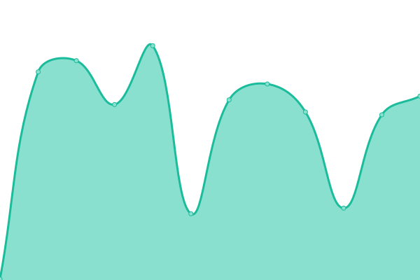
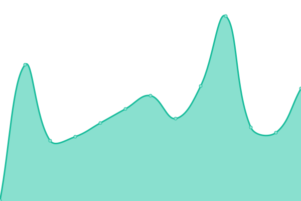
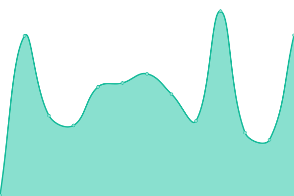

# [📈 Live Status](https://pizza-status.evankchase.click/): <!--live status--> **🟧 Partial outage**

This repository contains the open-source uptime monitor and status page for [code_addict](https://https://pizza-status.evankchase.click/), powered by [Upptime](https://github.com/upptime/upptime).

With [Upptime](https://upptime.js.org), you can get your own unlimited and free uptime monitor and status page, powered entirely by a GitHub repository. We use [Issues](https://github.com/EthanSuperior/jwt-pizza-status/issues) as incident reports, [Actions](https://github.com/EthanSuperior/jwt-pizza-status/actions) as uptime monitors, and [Pages](https://pizza-status.evankchase.click/) for the status page.

<!--start: status pages-->
<!-- This summary is generated by Upptime (https://github.com/upptime/upptime) -->
<!-- Do not edit this manually, your changes will be overwritten -->
<!-- prettier-ignore -->
| URL | Status | History | Response Time | Uptime |
| --- | ------ | ------- | ------------- | ------ |
|  [JWT-Pizza](https://pizza.evankchase.click/) | 🟥 Down | [jwt-pizza.yml](https://github.com/EthanSuperior/jwt-pizza-status/commits/HEAD/history/jwt-pizza.yml) | 

 182ms
     
 | 

<a href="https://pizza-status.evankchase.click/history/jwt-pizza">96.27%</a>
    

|  [JWT-Pizza Service](https://pizza-service.evankchase.click/) | 🟥 Down | [jwt-pizza-service.yml](https://github.com/EthanSuperior/jwt-pizza-status/commits/HEAD/history/jwt-pizza-service.yml) | 

 243ms
     
 | 

<a href="https://pizza-status.evankchase.click/history/jwt-pizza-service">96.02%</a>
    

|  [JWT-Pizza Factory](https://pizza-factory.cs329.click/api/docs) | 🟩 Up | [jwt-pizza-factory.yml](https://github.com/EthanSuperior/jwt-pizza-status/commits/HEAD/history/jwt-pizza-factory.yml) | 

 166ms
     
 | 

<a href="https://pizza-status.evankchase.click/history/jwt-pizza-factory">100.00%</a>
    

<!--end: status pages-->

[**Visit our status website →**](https://pizza-status.evankchase.click/)

## 📄 License

- Powered by: [Upptime](https://github.com/upptime/upptime)
- Code: [MIT](./LICENSE) © [Anand Chowdhary](https://anandchowdhary.com), supported by [Pabio](https://pabio.com)
- Data in the `./history` directory: [Open Database License](https://opendatacommons.org/licenses/odbl/1-0/)
